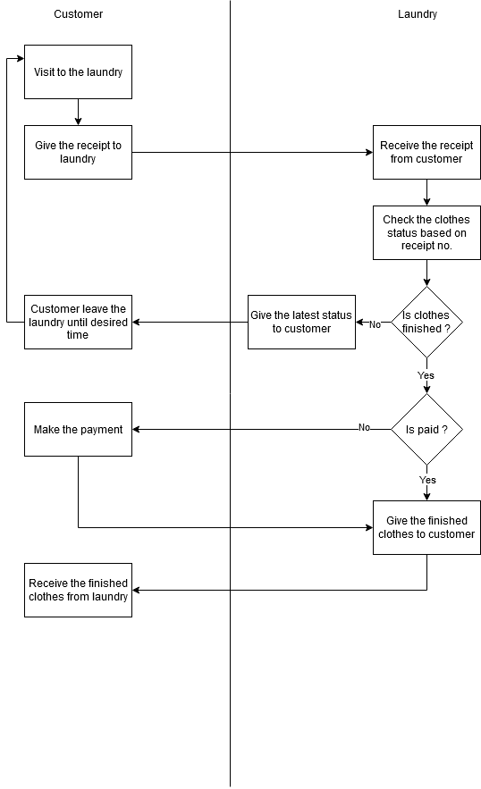

# Laundry POS (Backend)

## Current Business Flow

- Stage 1 diagram

  

- Stage 2 diagram

  

## The Problems

- Sometimes, the laundry left behind some clothes that want to the next process, so it not proper the sequence and the priority
- Sometimes, the laundry forgot the finished clothes location when the customer want to picking-up

## The Solutions

- Need a system to remaind the estimation of clothes process based on the duration that choosen by the customer, so the laundry can order the priority to be finished
- Need a system to update the status of the clothes, so the customer will get the notification regarding the status. The customer also can track the status using provided public webpage (seems like logistic tracking)
- Need a system for the laundry to set the location for the finished the clothes process, so the laundry can be find easily where the finished clothes they area putted in when the customer want to picking-up

## Software Requirement Specification (SRS)

### Functional Requirements

### Non-functional Requirements

### Use Case Diagram

### Database Diagram
